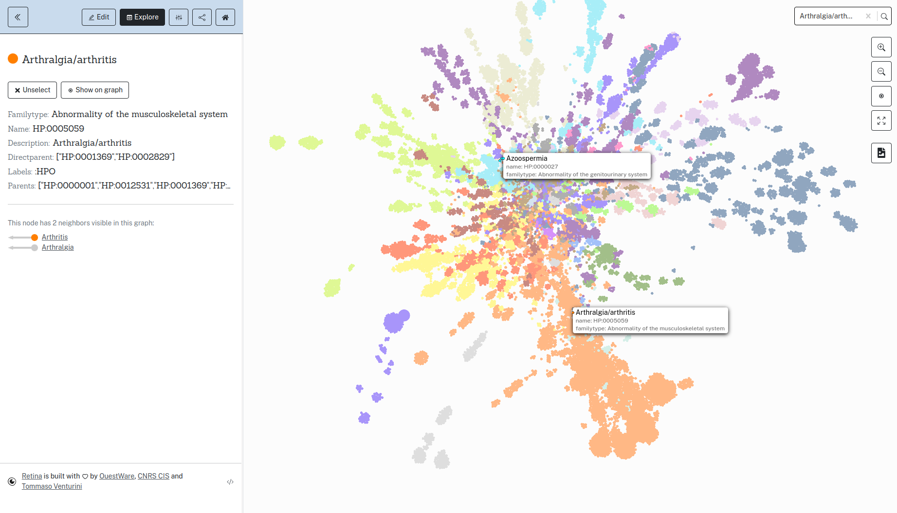
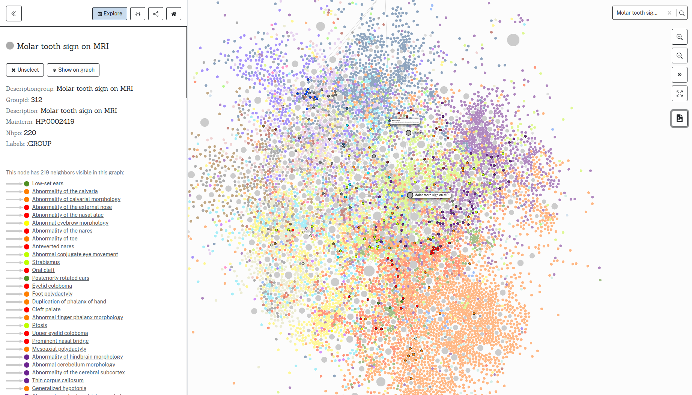

# PhenoGenius

Symptom interaction modeling for precision medicine

## Overview

Symptom interaction model provide a method to standardize clinical descriptions and fully exploit phenotypic data in precision medicine.

This repository contains scripts and files to use PhenoGenius, the phenotype matching system for genetic disease based on this model. **Please try PhenoGenius in the cloud at [https://huggingface.co/spaces/kyauy/PhenoGenius](https://huggingface.co/spaces/kyauy/PhenoGenius).**

If you use PhenoGenius, please cite:
> Yauy et al., Learning phenotypic patterns in genetic disease by symptom interaction modeling. medrXiv (2023). [https://doi.org/10.1101/2022.07.29.22278181](https://doi.org/10.1101/2022.07.29.22278181)

Last update annotation : `2024-07-15`

## Install

- Requirements

```bash
python >=3.11
poetry #(https://python-poetry.org/docs/#installation)
```

- Install dependencies

```bash
poetry install
```

## Use command-line client

### Run

```bash
poetry shell
python phenogenius_cli.py --hpo_list HP:0000107,HP:0000108,HP:0001407,HP:0005562 --result_file PKD1.tsv
```
```
Usage: phenogenius_cli.py [OPTIONS]

Options:
  --version           Show the version and exit.
  --result_file TEXT  Output file name, default = match.tsv
  --hpo_list TEXT     (Mandatory) List of HPO terms to match, separated with
                      commas
  --gene_list TEXT    (Optional) List of genes in NCBI ID format to match,
                      separated with commas
```

| Field                         | Description                                                                                                               |
|-------------------------------|---------------------------------------------------------------------------------------------------------------------------|
| `gene_id`                     | NCBI gene identifier                                                                                                      |
| `gene_symbol`                 | HGNC gene symbol                                                                                                          |
| `rank`                        | Output line position, from the most to the less "phenotype matching" (integer)                                            |
| `score`                       | “Phenotype matching”: confidence of the symptoms gene association. The higher it is, the higher this confidence (float)   |
| `hpo_implicated`              | List of HPO IDs associated to the gene (scores correspond to confidence to each HPO gene association)                     |
| `hpo_description_implicated`  | List of HPO names associated to the gene                                                                                  |
| `phenotype_specificity`       | Phenotype specificity into one of "A", "B", "C" or "D"                                                                    |
|                               | A - Highly specific and relatively unique to the gene (top 40, 50% of diagnosis in PhenoGenius cohort)                    |
|                               | B - Consistent with the gene, highly specific, but not unique (top 250, 75% of diagnosis in PhenoGenius cohort)           |
|                               | C - Limited association, not highly specific or with high genetic heterogeneity                                           |
|                               | D - Not consistent with what is expected for the gene/genomic region or not consistent in general                         |


## Explore interactive graphs of symptoms interactions

### Human Phenotype Ontology

Click on the image!
[](https://ouestware.gitlab.io/retina/beta/#/graph/?url=https%3A%2F%2Fraw.githubusercontent.com%2Fkyauy%2FPhenoGenius%2Fmain%2Fdata%2Fgraph%2Fontology.gexf&r=v&n=n3453&sa=r&ca=f&st[]=n&st[]=f)

### Groups of interacting symptoms

Click on the image!
[](https://ouestware.gitlab.io/retina/beta/#/graph/?url=https%3A%2F%2Fraw.githubusercontent.com%2Fkyauy%2FPhenoGenius%2Fmain%2Fdata%2Fgraph%2F390groups.gexf&r=v&n=n16738&sa=r&ca[]=f&ca[]=l&st=f&ls=5oGenius%2Fmain%2Fdata%2Fgraph%2Fontology.gexf&r=v&n=n3453&sa=r&ca=f&st[]=n&st[]=f)

Enjoy !

## License

*PhenoGenius* is licensed under the Apache License, Version 2.0. See [LICENSE](LICENSE) for the full license text.

## Misc

*PhenoGenius* is a collaboration of :

[](https://seqone.com/)

[](https://iab.univ-grenoble-alpes.fr/)


